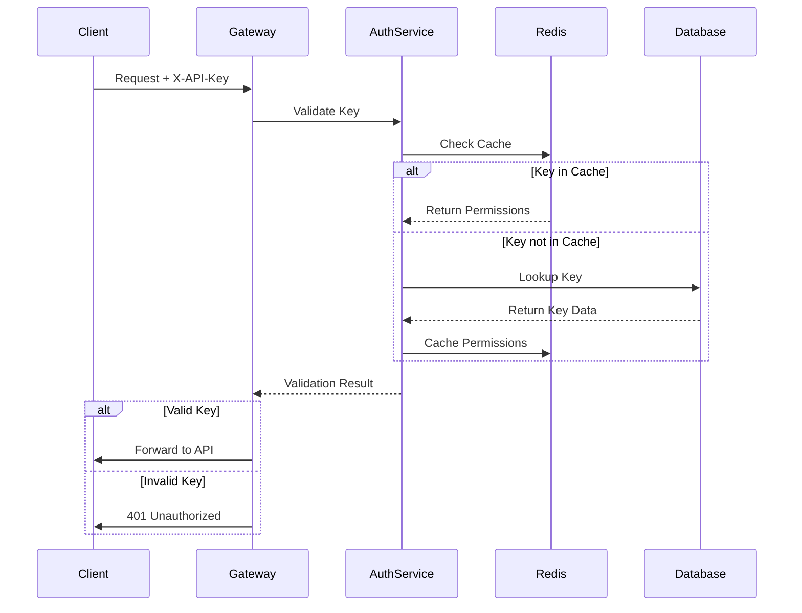
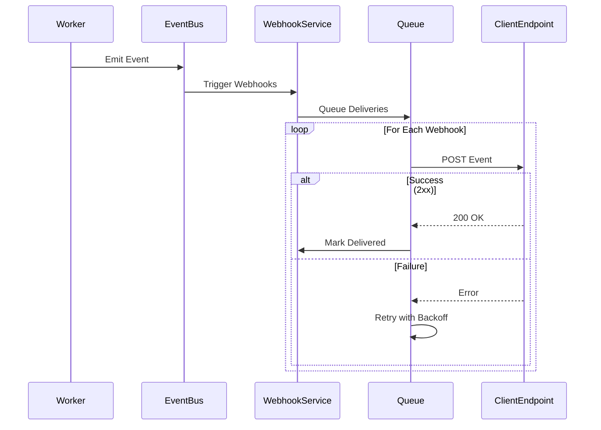

# API Design Document - bkrptr API v1.0

## Table of Contents
1. [Architecture Overview](#architecture-overview)
2. [API Design Principles](#api-design-principles)
3. [Authentication Flow](#authentication-flow)
4. [Webhook Implementation](#webhook-implementation)
5. [Rate Limiting Strategy](#rate-limiting-strategy)
6. [Error Handling Patterns](#error-handling-patterns)
7. [Versioning Strategy](#versioning-strategy)
8. [Security Considerations](#security-considerations)
9. [Performance Optimization](#performance-optimization)
10. [Monitoring & Observability](#monitoring--observability)

---

## Architecture Overview

### System Architecture

```
┌─────────────────────────────────────────────────────────────────┐
│                          API Clients                            │
│   (stafchef, Web Dashboard, Mobile Apps, Enterprise Systems)    │
└─────────────────────┬────────────────────────────────────────────┘
                      │ HTTPS/TLS 1.2+
                      ▼
┌─────────────────────────────────────────────────────────────────┐
│                      CDN Layer (CloudFlare)                     │
│               • DDoS Protection                                 │
│               • Geographic Distribution                         │
│               • SSL Termination                                 │
└─────────────────────┬────────────────────────────────────────────┘
                      │
                      ▼
┌─────────────────────────────────────────────────────────────────┐
│                    API Gateway (Kong/AWS API Gateway)           │
│               • Rate Limiting                                   │
│               • API Key Validation                              │
│               • Request/Response Transformation                 │
│               • Circuit Breaking                                │
└─────────────────────┬────────────────────────────────────────────┘
                      │
                      ▼
┌─────────────────────────────────────────────────────────────────┐
│                  Load Balancer (AWS ALB/NLB)                    │
│               • Health Checks                                   │
│               • Auto-scaling Triggers                           │
└──────────┬──────────┴──────────┬─────────────────────────────────┘
           │                     │
           ▼                     ▼
┌──────────────────────┐  ┌──────────────────────┐
│   API Server 1       │  │   API Server N       │
│  (Node.js/Express)   │  │  (Node.js/Express)   │
│  • Request Handling  │  │  • Request Handling  │
│  • Business Logic    │  │  • Business Logic    │
│  • Validation        │  │  • Validation        │
└──────────┬───────────┘  └──────────┬───────────┘
           │                          │
           └──────────┬───────────────┘
                      │
        ┌─────────────┼─────────────┬───────────────┐
        ▼             ▼             ▼               ▼
┌──────────────┐ ┌──────────────┐ ┌──────────────┐ ┌──────────────┐
│  PostgreSQL  │ │    Redis     │ │  S3 Storage  │ │  Queue (SQS) │
│   (Primary)  │ │   (Cache)    │ │  (Documents) │ │   (Jobs)     │
└──────────────┘ └──────────────┘ └──────────────┘ └──────┬───────┘
                                                            │
                                                            ▼
                                        ┌───────────────────────────┐
                                        │   Processing Workers      │
                                        │  • Batch Processor        │
                                        │  • Expedited Processor    │
                                        │  • Anthropic API Client   │
                                        └───────────────────────────┘
```

### Component Responsibilities

#### API Gateway Layer
- **Authentication**: Validates API keys before forwarding requests
- **Rate Limiting**: Enforces per-key and global rate limits
- **Request Routing**: Routes to appropriate service endpoints
- **Monitoring**: Tracks API metrics and performance

#### API Server Layer
- **Request Validation**: Validates request payloads using JSON Schema
- **Business Logic**: Implements core business rules
- **Database Operations**: Manages data persistence
- **Response Formatting**: Ensures consistent response structure

#### Data Layer
- **PostgreSQL**: Stores metadata, analysis records, user data
- **Redis**: Caches frequently accessed data, session storage
- **S3**: Stores generated documents and analysis results
- **SQS**: Manages job queue for asynchronous processing

#### Processing Layer
- **Batch Worker**: Processes batch analysis requests (24-hour SLA)
- **Expedited Worker**: Handles expedited requests (9-minute SLA)
- **Document Generator**: Creates output documents from analysis

---

## API Design Principles

### RESTful Design

#### Resource-Oriented URLs
```
GET    /v1/analyses          # Collection
POST   /v1/analyses          # Create
GET    /v1/analyses/{id}     # Instance
DELETE /v1/analyses/{id}     # Delete
POST   /v1/analyses/{id}/expedite  # Action
```

#### HTTP Methods
- **GET**: Retrieve resources (idempotent, cacheable)
- **POST**: Create resources or trigger actions
- **PUT**: Full resource update (idempotent)
- **PATCH**: Partial resource update
- **DELETE**: Remove resources (idempotent)

#### Status Codes
```
200 OK              - Successful GET, PUT, PATCH
201 Created         - Successful POST with resource creation
204 No Content      - Successful DELETE
400 Bad Request     - Validation errors
401 Unauthorized    - Missing/invalid authentication
403 Forbidden       - Insufficient permissions
404 Not Found       - Resource doesn't exist
409 Conflict        - Resource conflict (e.g., duplicate)
429 Too Many Requests - Rate limit exceeded
500 Internal Error  - Server error
503 Service Unavailable - Temporary unavailability
```

### Request/Response Design

#### Request Headers
```http
X-API-Key: bkrptr_live_k3x9mP2nQ8vR5tY7wA4zB6cD1eF3gH2j_a7c9
Content-Type: application/json
Accept: application/json
X-Idempotency-Key: unique-request-123
X-Request-ID: 550e8400-e29b-41d4-a716-446655440000
```

#### Response Headers
```http
X-Request-ID: 550e8400-e29b-41d4-a716-446655440000
X-RateLimit-Limit: 1000
X-RateLimit-Remaining: 995
X-RateLimit-Reset: 1698765432
X-Response-Time: 145ms
Content-Type: application/json; charset=utf-8
Cache-Control: private, max-age=0
```

### Idempotency

#### Implementation
```javascript
// Server-side idempotency handling
async function handleRequest(req, res) {
  const idempotencyKey = req.headers['x-idempotency-key'];

  if (idempotencyKey) {
    // Check cache for existing response
    const cached = await redis.get(`idempotency:${idempotencyKey}`);
    if (cached) {
      return res.status(200).json(JSON.parse(cached));
    }
  }

  // Process request
  const result = await processAnalysisRequest(req.body);

  // Cache response for idempotency
  if (idempotencyKey) {
    await redis.setex(
      `idempotency:${idempotencyKey}`,
      86400, // 24 hours
      JSON.stringify(result)
    );
  }

  return res.status(201).json(result);
}
```

---

## Authentication Flow

### API Key Structure

```
Format: bkrptr_{environment}_{random32}_{checksum}
Example: bkrptr_live_k3x9mP2nQ8vR5tY7wA4zB6cD1eF3gH2j_a7c9

Components:
- Prefix: "bkrptr" (service identifier)
- Environment: "live" | "test" | "sandbox"
- Random: 32 character cryptographically secure string
- Checksum: 4 character validation checksum
```

### Key Generation Process

```javascript
const crypto = require('crypto');

function generateApiKey(environment = 'live') {
  // Generate random bytes
  const randomBytes = crypto.randomBytes(24);
  const randomString = randomBytes.toString('base64')
    .replace(/\+/g, '')
    .replace(/\//g, '')
    .replace(/=/g, '')
    .substring(0, 32);

  // Calculate checksum
  const payload = `bkrptr_${environment}_${randomString}`;
  const checksum = crypto
    .createHash('sha256')
    .update(payload)
    .digest('hex')
    .substring(0, 4);

  return `${payload}_${checksum}`;
}
```

### Key Validation Flow



### Permission Model

```javascript
const permissions = {
  'analyses.read': ['GET /analyses', 'GET /analyses/*'],
  'analyses.write': ['POST /analyses', 'DELETE /analyses/*'],
  'webhooks.manage': ['POST /webhooks', 'PUT /webhooks/*', 'DELETE /webhooks/*'],
  'account.read': ['GET /account', 'GET /account/usage'],
  'admin': ['*'] // Full access
};
```

---

## Webhook Implementation

### Webhook Event Flow



### Event Payload Structure

```json
{
  "id": "evt_1a2b3c4d5e6f",
  "type": "analysis.completed",
  "created": 1698765432,
  "data": {
    "analysisId": "ana_xyz789abc",
    "book": {
      "title": "Atomic Habits",
      "author": "James Clear"
    },
    "status": "completed",
    "processingTime": 518,
    "cost": 0.03,
    "documents": [
      {
        "type": "madho-summary",
        "url": "https://api.bkrptr.com/v1/analyses/ana_xyz789abc/documents/madho-summary",
        "size": 6400,
        "format": "markdown"
      }
    ]
  }
}
```

### Signature Verification

```javascript
// Server-side: Generate signature
function generateWebhookSignature(payload, secret) {
  const timestamp = Math.floor(Date.now() / 1000);
  const message = `${timestamp}.${JSON.stringify(payload)}`;
  const signature = crypto
    .createHmac('sha256', secret)
    .update(message)
    .digest('hex');

  return {
    signature: `t=${timestamp},v1=${signature}`,
    payload
  };
}

// Client-side: Verify signature
function verifyWebhookSignature(payload, signature, secret) {
  const elements = signature.split(',');
  const timestamp = elements[0].split('=')[1];
  const receivedSignature = elements[1].split('=')[1];

  // Check timestamp (prevent replay attacks)
  const currentTime = Math.floor(Date.now() / 1000);
  if (currentTime - parseInt(timestamp) > 300) { // 5 minutes
    throw new Error('Webhook timestamp too old');
  }

  // Verify signature
  const expectedSignature = crypto
    .createHmac('sha256', secret)
    .update(`${timestamp}.${JSON.stringify(payload)}`)
    .digest('hex');

  return crypto.timingSafeEqual(
    Buffer.from(receivedSignature),
    Buffer.from(expectedSignature)
  );
}
```

### Retry Strategy

```javascript
const retryConfig = {
  maxAttempts: 5,
  initialDelay: 1000, // 1 second
  maxDelay: 3600000, // 1 hour
  backoffMultiplier: 2,

  getDelay(attempt) {
    const delay = this.initialDelay * Math.pow(this.backoffMultiplier, attempt - 1);
    return Math.min(delay, this.maxDelay);
  },

  schedule: [
    { attempt: 1, delay: '1 second' },
    { attempt: 2, delay: '2 seconds' },
    { attempt: 3, delay: '4 seconds' },
    { attempt: 4, delay: '8 seconds' },
    { attempt: 5, delay: '16 seconds' }
  ]
};
```

---

## Rate Limiting Strategy

### Tiered Rate Limits

| Tier | Requests/Hour | Burst Capacity | Cost/Month | Target Audience |
|------|--------------|----------------|------------|-----------------|
| **Free** | 100 | 10 | $0 | Individual developers |
| **Standard** | 1,000 | 50 | $29 | Small teams |
| **Premium** | 10,000 | 200 | $99 | Growing companies |
| **Enterprise** | Custom | Custom | Custom | Large organizations |

### Implementation

```javascript
// Token bucket algorithm
class RateLimiter {
  constructor(limit, windowMs, burstCapacity) {
    this.limit = limit;
    this.windowMs = windowMs;
    this.burstCapacity = burstCapacity;
    this.tokens = new Map();
  }

  async checkLimit(key) {
    const now = Date.now();
    const bucket = this.tokens.get(key) || {
      tokens: this.limit,
      lastRefill: now
    };

    // Refill tokens based on time passed
    const timePassed = now - bucket.lastRefill;
    const tokensToAdd = (timePassed / this.windowMs) * this.limit;
    bucket.tokens = Math.min(
      this.limit + this.burstCapacity,
      bucket.tokens + tokensToAdd
    );
    bucket.lastRefill = now;

    if (bucket.tokens >= 1) {
      bucket.tokens -= 1;
      this.tokens.set(key, bucket);

      return {
        allowed: true,
        remaining: Math.floor(bucket.tokens),
        reset: now + this.windowMs
      };
    }

    return {
      allowed: false,
      remaining: 0,
      reset: now + this.windowMs,
      retryAfter: Math.ceil((1 - bucket.tokens) * this.windowMs / this.limit)
    };
  }
}
```

### Rate Limit Headers

```http
X-RateLimit-Limit: 1000
X-RateLimit-Remaining: 995
X-RateLimit-Reset: 1698765432
X-RateLimit-Burst: 50
Retry-After: 3600 (only when rate limited)
```

---

## Error Handling Patterns

### Error Response Structure

```json
{
  "error": {
    "code": "VALIDATION_ERROR",
    "message": "Request validation failed",
    "details": {
      "fields": {
        "book.title": "Title is required",
        "book.author": "Author name too long (max 500 characters)"
      }
    },
    "requestId": "550e8400-e29b-41d4-a716-446655440000",
    "timestamp": "2025-10-19T12:34:56Z",
    "documentation": "https://docs.bkrptr.com/errors/VALIDATION_ERROR"
  }
}
```

### Error Codes

| Code | HTTP Status | Description | Retry Strategy |
|------|-------------|-------------|----------------|
| `INVALID_REQUEST` | 400 | Malformed request | No retry |
| `VALIDATION_ERROR` | 400 | Field validation failed | Fix and retry |
| `UNAUTHORIZED` | 401 | Invalid/missing API key | No retry |
| `FORBIDDEN` | 403 | Insufficient permissions | No retry |
| `NOT_FOUND` | 404 | Resource not found | No retry |
| `CONFLICT` | 409 | Resource conflict | Check state and retry |
| `RATE_LIMIT_EXCEEDED` | 429 | Too many requests | Retry after delay |
| `INTERNAL_ERROR` | 500 | Server error | Retry with backoff |
| `SERVICE_UNAVAILABLE` | 503 | Temporary outage | Retry with backoff |

### Error Handling Middleware

```javascript
class ApiError extends Error {
  constructor(code, message, statusCode, details = null) {
    super(message);
    this.code = code;
    this.statusCode = statusCode;
    this.details = details;
  }
}

function errorHandler(err, req, res, next) {
  const requestId = req.headers['x-request-id'];

  // Log error
  logger.error({
    error: err,
    requestId,
    path: req.path,
    method: req.method
  });

  // Prepare response
  let statusCode = 500;
  let errorResponse = {
    error: {
      code: 'INTERNAL_ERROR',
      message: 'An unexpected error occurred',
      requestId,
      timestamp: new Date().toISOString()
    }
  };

  if (err instanceof ApiError) {
    statusCode = err.statusCode;
    errorResponse.error.code = err.code;
    errorResponse.error.message = err.message;
    errorResponse.error.details = err.details;
  } else if (err.name === 'ValidationError') {
    statusCode = 400;
    errorResponse.error.code = 'VALIDATION_ERROR';
    errorResponse.error.message = 'Request validation failed';
    errorResponse.error.details = formatValidationErrors(err);
  }

  // Add documentation link
  errorResponse.error.documentation =
    `https://docs.bkrptr.com/errors/${errorResponse.error.code}`;

  res.status(statusCode).json(errorResponse);
}
```

---

## Versioning Strategy

### URL Versioning

```
https://api.bkrptr.com/v1/analyses
https://api.bkrptr.com/v2/analyses  (future)
```

### Version Lifecycle

| Phase | Duration | Description |
|-------|----------|-------------|
| **Beta** | 3 months | New version in testing |
| **Current** | 12+ months | Recommended version |
| **Deprecated** | 6 months | Still functional, migration recommended |
| **Sunset** | - | No longer available |

### Deprecation Headers

```http
Sunset: Sat, 31 Dec 2025 23:59:59 GMT
Deprecation: true
Link: <https://api.bkrptr.com/v2/analyses>; rel="successor-version"
Warning: 299 - "This API version is deprecated. Please migrate to v2."
```

### Migration Support

```javascript
// Automatic version forwarding for smooth migration
app.use('/v1/*', (req, res, next) => {
  // Check if v1 is deprecated
  if (config.deprecatedVersions.includes('v1')) {
    res.set('Deprecation', 'true');
    res.set('Sunset', config.v1SunsetDate);
    res.set('Warning', '299 - "API v1 is deprecated. Please migrate to v2."');
  }

  // Forward to current implementation
  next();
});
```

---

## Security Considerations

### Transport Security
- **HTTPS Only**: All API traffic must use TLS 1.2+
- **HSTS**: Strict-Transport-Security header enforced
- **Certificate Pinning**: Optional for mobile/desktop clients

### Input Validation
```javascript
const schemas = {
  bookInput: Joi.object({
    title: Joi.string().min(1).max(500).required(),
    author: Joi.string().min(1).max(500).required(),
    isbn: Joi.string().pattern(/^(97[89])?[0-9]{9}[0-9X]$/),
    genre: Joi.string().valid(...VALID_GENRES)
  }),

  analysisOptions: Joi.object({
    processingMode: Joi.string().valid('batch', 'expedited').default('batch'),
    analysisDepth: Joi.string().valid('quick', 'standard', 'comprehensive').default('standard'),
    targetAudience: Joi.string().valid(...VALID_AUDIENCES).default('general'),
    additionalContext: Joi.string().max(1000)
  })
};
```

### SQL Injection Prevention
```javascript
// Use parameterized queries
const query = `
  INSERT INTO analyses (id, book_title, book_author, status, api_key_id)
  VALUES ($1, $2, $3, $4, $5)
`;
const values = [analysisId, title, author, 'pending', apiKeyId];
await db.query(query, values);
```

### Secret Management
- API keys stored with bcrypt hashing
- Webhook secrets encrypted at rest
- Environment variables for sensitive config
- Regular key rotation (90 days recommended)

### CORS Configuration
```javascript
const corsOptions = {
  origin: function (origin, callback) {
    // Allow specific origins
    const allowedOrigins = [
      'https://bkrptr.com',
      'https://dashboard.bkrptr.com',
      'https://stafchef.com'
    ];

    if (!origin || allowedOrigins.indexOf(origin) !== -1) {
      callback(null, true);
    } else {
      callback(new Error('Not allowed by CORS'));
    }
  },
  credentials: true,
  methods: ['GET', 'POST', 'PUT', 'DELETE'],
  allowedHeaders: ['Content-Type', 'X-API-Key', 'X-Idempotency-Key'],
  exposedHeaders: ['X-RateLimit-Limit', 'X-RateLimit-Remaining', 'X-RateLimit-Reset']
};
```

---

## Performance Optimization

### Caching Strategy

#### Cache Layers
1. **CDN Cache**: Static content, documentation
2. **Redis Cache**: API responses, session data
3. **Application Cache**: In-memory caching for hot data

#### Cache Headers
```http
Cache-Control: private, max-age=300
ETag: "33a64df551425fcc55e4d42a148795d9f25f89d4"
Last-Modified: Wed, 21 Oct 2025 07:28:00 GMT
```

#### Cache Implementation
```javascript
async function getCachedAnalysis(analysisId) {
  const cacheKey = `analysis:${analysisId}`;

  // Check Redis cache
  const cached = await redis.get(cacheKey);
  if (cached) {
    return JSON.parse(cached);
  }

  // Fetch from database
  const analysis = await db.getAnalysis(analysisId);

  // Cache for 5 minutes
  await redis.setex(cacheKey, 300, JSON.stringify(analysis));

  return analysis;
}
```

### Database Optimization

#### Connection Pooling
```javascript
const pool = new Pool({
  host: process.env.DB_HOST,
  port: process.env.DB_PORT,
  database: process.env.DB_NAME,
  user: process.env.DB_USER,
  password: process.env.DB_PASSWORD,
  max: 20, // Maximum pool size
  idleTimeoutMillis: 30000,
  connectionTimeoutMillis: 2000
});
```

#### Query Optimization
```sql
-- Use indexes for common queries
CREATE INDEX idx_analyses_api_key_status ON analyses(api_key_id, status);
CREATE INDEX idx_analyses_submitted_at ON analyses(submitted_at DESC);

-- Pagination with cursor
SELECT * FROM analyses
WHERE api_key_id = $1
  AND submitted_at < $2
ORDER BY submitted_at DESC
LIMIT 25;
```

### Response Compression
```javascript
app.use(compression({
  filter: (req, res) => {
    // Compress JSON responses
    return /json/.test(res.getHeader('Content-Type'));
  },
  threshold: 1024 // Only compress if > 1KB
}));
```

---

## Monitoring & Observability

### Metrics to Track

#### API Metrics
- Request rate (requests/second)
- Response time (p50, p95, p99)
- Error rate (4xx, 5xx)
- Success rate
- Concurrent connections

#### Business Metrics
- Analyses created per hour
- Processing completion rate
- Average processing time
- Cost per analysis
- API key usage distribution

### Logging Strategy

#### Log Levels
```javascript
const logLevels = {
  error: 0,   // System errors, failures
  warn: 1,    // Degraded performance, retries
  info: 2,    // Normal operations
  http: 3,    // HTTP requests/responses
  debug: 4    // Detailed debugging info
};
```

#### Structured Logging
```javascript
logger.info({
  event: 'analysis.created',
  analysisId: 'ana_xyz789',
  bookTitle: 'Atomic Habits',
  processingMode: 'batch',
  apiKeyId: 'key_abc123',
  requestId: '550e8400-e29b-41d4',
  timestamp: new Date().toISOString()
});
```

### Health Checks

#### Endpoints
```
GET /health        - Basic health check
GET /health/live   - Liveness probe (Kubernetes)
GET /health/ready  - Readiness probe (Kubernetes)
```

#### Health Check Response
```json
{
  "status": "healthy",
  "timestamp": "2025-10-19T12:34:56Z",
  "version": "1.0.0",
  "uptime": 86400,
  "checks": {
    "database": "healthy",
    "redis": "healthy",
    "queue": "healthy",
    "storage": "healthy"
  }
}
```

### Alerting Rules

| Metric | Threshold | Alert Level | Action |
|--------|-----------|-------------|--------|
| Error Rate | > 1% | Warning | Investigate logs |
| Error Rate | > 5% | Critical | Page on-call |
| Response Time p95 | > 1s | Warning | Check performance |
| Response Time p95 | > 3s | Critical | Scale resources |
| Queue Depth | > 1000 | Warning | Monitor growth |
| Queue Depth | > 5000 | Critical | Add workers |

---

## Appendix A: Status Code Decision Tree

```
Request Received
    │
    ├── Authentication Check
    │   ├── No API Key → 401 Unauthorized
    │   └── Invalid Key → 401 Unauthorized
    │
    ├── Authorization Check
    │   └── Insufficient Permissions → 403 Forbidden
    │
    ├── Rate Limit Check
    │   └── Limit Exceeded → 429 Too Many Requests
    │
    ├── Validation Check
    │   ├── Malformed JSON → 400 Bad Request
    │   └── Invalid Fields → 400 Bad Request
    │
    ├── Resource Check
    │   └── Not Found → 404 Not Found
    │
    ├── Business Logic
    │   ├── Success
    │   │   ├── GET → 200 OK
    │   │   ├── POST (create) → 201 Created
    │   │   ├── PUT/PATCH → 200 OK
    │   │   └── DELETE → 204 No Content
    │   │
    │   └── Failure
    │       ├── Conflict → 409 Conflict
    │       ├── Server Error → 500 Internal Error
    │       └── Service Down → 503 Service Unavailable
```

---

## Appendix B: API Client Best Practices

### Retry Logic
```javascript
async function apiCall(url, options, maxRetries = 3) {
  for (let i = 0; i < maxRetries; i++) {
    try {
      const response = await fetch(url, options);

      if (response.ok) {
        return await response.json();
      }

      // Don't retry client errors (4xx) except 429
      if (response.status >= 400 && response.status < 500 && response.status !== 429) {
        throw new Error(`Client error: ${response.status}`);
      }

      // Retry server errors (5xx) and rate limits (429)
      if (i < maxRetries - 1) {
        const delay = Math.pow(2, i) * 1000; // Exponential backoff
        await new Promise(resolve => setTimeout(resolve, delay));
        continue;
      }

      throw new Error(`Server error: ${response.status}`);
    } catch (error) {
      if (i === maxRetries - 1) throw error;

      // Network error, retry
      const delay = Math.pow(2, i) * 1000;
      await new Promise(resolve => setTimeout(resolve, delay));
    }
  }
}
```

### Connection Pooling
```javascript
const https = require('https');

const agent = new https.Agent({
  keepAlive: true,
  keepAliveMsecs: 1000,
  maxSockets: 25,
  maxFreeSockets: 5,
  timeout: 30000
});

// Use agent for all API calls
const options = {
  agent,
  method: 'POST',
  headers: {
    'X-API-Key': apiKey,
    'Content-Type': 'application/json'
  }
};
```

---

*End of API Design Document*